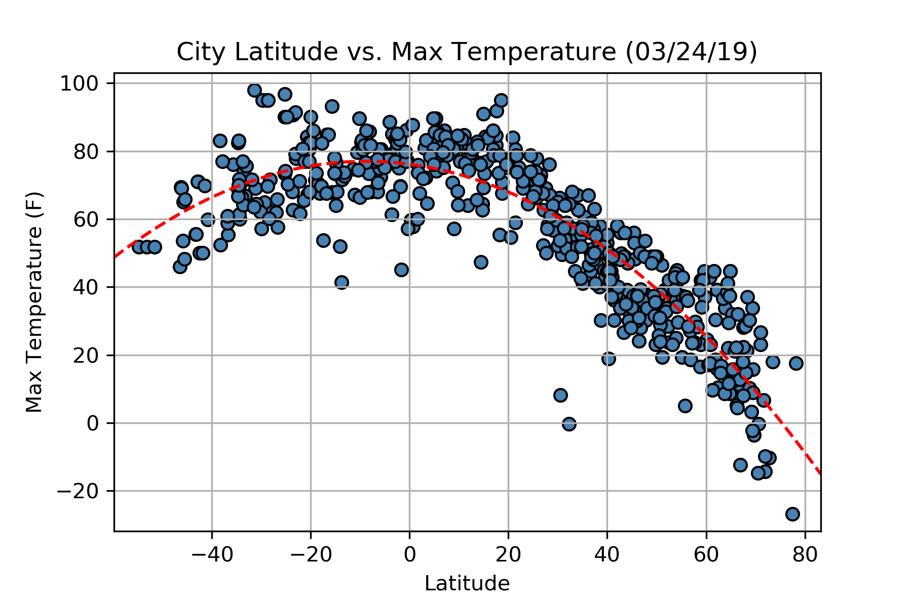
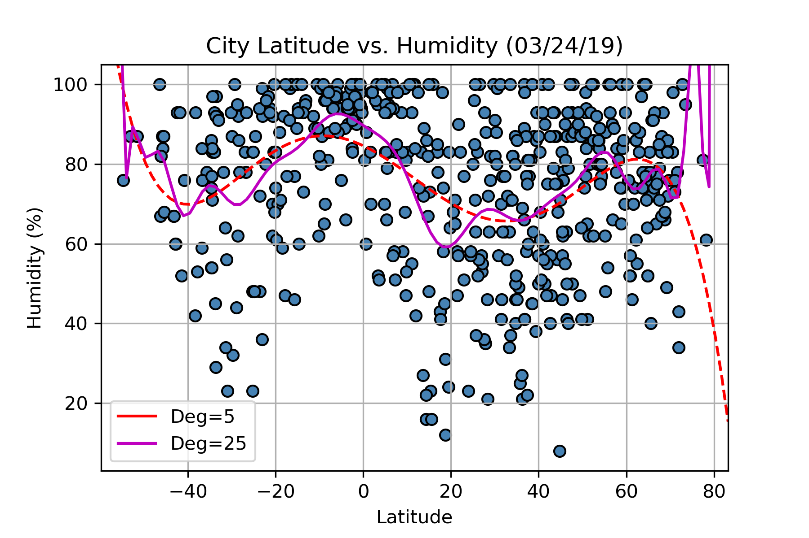
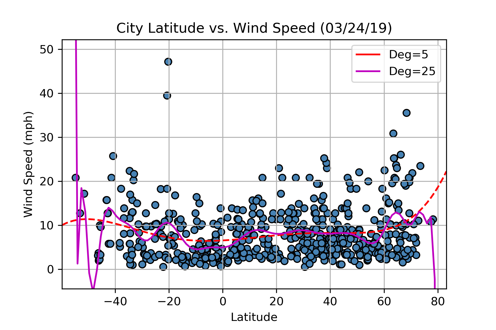

# DESCRIPTIONS OF OBSERVATIONS

**1. Latitude vs. Temperature:**

The scatter plot of *Latitude vs. Temperature* falls into a **parabola** manner: Starting from the equator, it cools down with an increasing latitude towards both poles. As seen on the graph below, a quadratic regression curve in red dashed line perfectly echoed dot distribution pattern. The highest estimated temperature calculated by the curve is around 8.8oS, whereas classical textbook tells us that in late March the closest latitude to the sun on earth (with the highest temperature) is around the equator. As compared to its counterpart, south hemisphere has significantly broader ocean areas. Water has a much higher specific heat capacity than the land does. There might be a lag for the temperature to drop down from summer to autumn in south hemisphere. Interestingly, five out of six cities with the highest temperature locate even further south around 30o in Australia (“Port Macquarie”, “Yulara”, “Inverell”, “Byron Bay”, and “Codrington”). Other countries in this latitude are South Africa, Brazil, Chile, and Argentina. However, continent only constitutes for a small portion in area. The only thing can be seen elsewhere is ocean.

**2. Latitude vs. Humidity and Cloudiness:**

Relative humidity (RH), referred to as “humidity” here, is the amount of moisture in the air divided by how much moisture the air can hold. Many factors are able to affect RH, with temperature sitting at the top hierarchy. Specifically, population (heat island effect), automobiles on the road (water vapor in the exhausts), as well as surrounding landscapes (forests, river, desert …) etc. might be determinants for city RH. Back to the *Latitude vs. Humidity* figure, polynomial regression with relatively low (deg=5, red dashed line) and high (deg=25, magenta solid line) degrees both suggest there be RH peaks around 10oS and 60oN and grooves around 40oS and 35oN. As revealed above, the 10oS peak is most likely high-temperature-driven. The 60oN peak, on the other hand, could have been due to the decrease in air capacity to hold the moisture (will be discussed right away for the contribution of low atmospheric pressure). Another plausible explanation is that the cold, dense Arctic polar water descends along the ocean bottom toward the equator, which stirs the surface water in the ocean around 60oN to vaporize to the air. Notably, both 10oS (Equatorial LPZ) and 60oN (Subpolar LPZ) locates in low pressure zone (LPZ), it seems that the atmospheric pressure does contribute to the RH. More supports come from the analysis of RH groove as 40oS and 35oN (low in RH), which are in Subtropical High Pressure Zone.

Since cloud is considered as a large collection of very tiny droplets of water in the air, it is easy to speculate that cloud is hard to form where the RH is low. It holds true that around 10oS and 60oN peaks, dots are floating higher, whereas in 40oS and 35oN groove dots are tend to sink towards the bottom on the figure of *lat_vs_cloudiness*”.

**3. Latitude vs. Wind Speed:**

Similar to the analysis of Latitude vs. Humidity, polynomial regression was plotted with both low (deg=5, red dashed line) and high (deg=25, magenta solid line) degrees in analyzing Latitude vs. Wind Speed. As seen on *lat_vs_wind_speed_polyfit*”, the low deg line is pretty flat. Although the high deg line does give us some peaks and grooves, the two lines do not share any significant trend in common. Therefore, it is hard to say the latitude of the city has any impact on wind speed.

